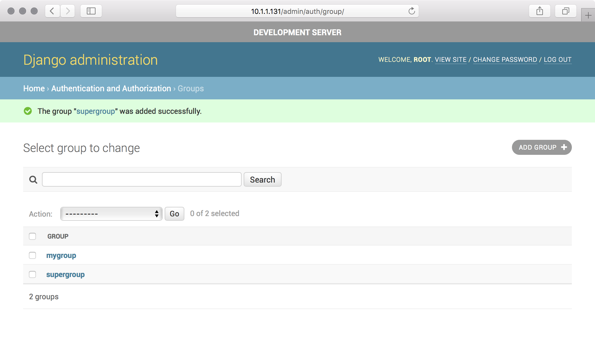
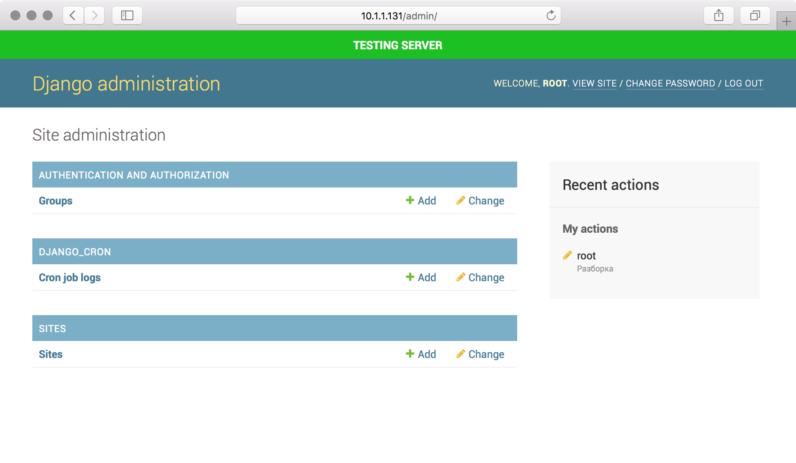

=============================
django-admin-env-notice
=============================

.. image:: https://badge.fury.io/py/django-admin-env-notice.svg
    :target: https://badge.fury.io/py/django-admin-env-notice

.. image:: https://travis-ci.org/dizballanze/django-admin-env-notice.svg?branch=master
    :target: https://travis-ci.org/dizballanze/django-admin-env-notice

.. image:: https://codecov.io/gh/dizballanze/django-admin-env-notice/branch/master/graph/badge.svg
    :target: https://codecov.io/gh/dizballanze/django-admin-env-notice

.. image:: https://img.shields.io/badge/Say%20Thanks-!-1EAEDB.svg
    :target: https://saythanks.io/to/dizballanze

Visually distinguish environments in Django Admin. Based on great advice from post: `5 ways to make Django Admin safer <https://hackernoon.com/5-ways-to-make-django-admin-safer-eb7753698ac8>`_ by `hakibenita <https://hackernoon.com/@hakibenita>`_.

Requirements
-----------

- Python 2.7, 3.4+
- Django 1.9+

Quickstart
----------

Install django-admin-env-notice::

    pip install django-admin-env-notice

Add it to your `INSTALLED_APPS` before `django.contrib.admin`:

.. code-block:: python

    INSTALLED_APPS = (
        ...
        'django_admin_env_notice',
        'django.contrib.admin',
        ...
    )

Add context processor:

.. code-block:: python

    TEMPLATES = [
        {
            ...
            "OPTIONS": {
                "context_processors": [
                    ...
                    "django_admin_env_notice.context_processors.from_settings",
                ],
            },
        },
    ]

Set label and color for current environment:

.. code-block:: python

    ENVIRONMENT_NAME = "Production server"
    ENVIRONMENT_COLOR = "#FF2222"

Override django admin selector if necessary (default: body), e.g: grappelli:

.. code-block:: python

    ENVIRONMENT_ADMIN_SELECTOR = "grp-header"

Optionally, set the environment banner to float over instead of being fixed to the top:

.. code-block:: python

    ENVIRONMENT_FLOAT = True

Screenshots
-----------

.. image:: ./screenshots/prod.png

Running Tests
-------------

Does the code actually work?

::

    source <YOURVIRTUALENV>/bin/activate
    (myenv) $ pip install tox
    (myenv) $ tox

Credits
-------

Tools used in rendering this package:

*  Cookiecutter_
*  `cookiecutter-djangopackage`_

.. _Cookiecutter: https://github.com/audreyr/cookiecutter
.. _`cookiecutter-djangopackage`: https://github.com/pydanny/cookiecutter-djangopackage
